# Loan-Approval-Prediction
Create a  model to predict if an applicant will be come delinquent on a loan payment, given the information provided in a typical loan application.

## Data
The data used was from already approved loan applicants and because of this was highly imbalanced. It contined a total of 48,216 rows with 19 features, 3,292 where Delinquent while 44,924 where Non Delinquent, this is about a 7 to 100 ratio. Most of the features contained numberals while a few contained strings. 

## Process
Below is the process I used to create and test my model. 
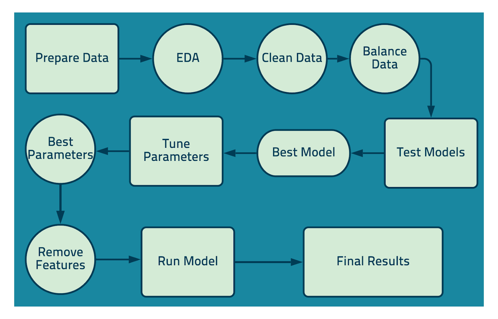
  
### EDA
While performing EDA I did not find any noticable trends in the scatter matrix. Below you can see there are no significant diffrence between delinquent and non delinquent. This was to be expected as the data was from already approved applicants. 

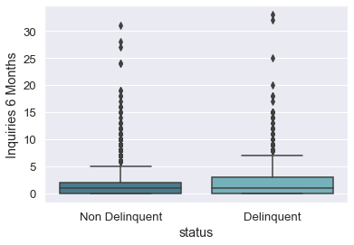
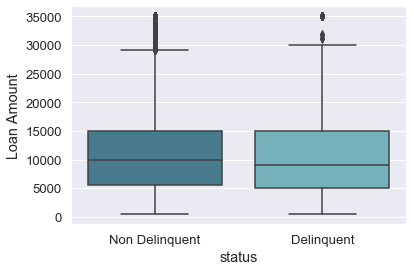
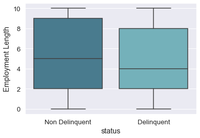
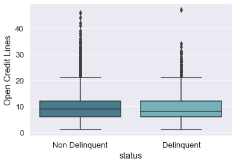

### Cleaning
While looking through the data I took out Revolving Credit Balance, Revolving Line Utilization, Account Now delinquent, Months since last Delinquency, Months since last record as they were either laking in data or did not pertain to a loan application, I also removed any rows that had ant Nan values. After this I was left with a total of 48,170, 44,889 Non Delinquent and 3,281. After I changed everything into numerical values by either using dummies or manulally chaning the values into numbers. 

### Testing and Balancing
For my models I tested diffrent Classification Regression models along with over and under sampling. Below is a chart showing the diffrent results I got for each model, I primarily looked at the recall score for each model because there is a high cost with a false negative. I decided to go with two models the first one is a prediction model (50/50) and the secound is a pridiction percentage model and I found the best threshold to use when I tuned the model later. I highlited the models Ichose for the final training and testing. 

#### Model 1
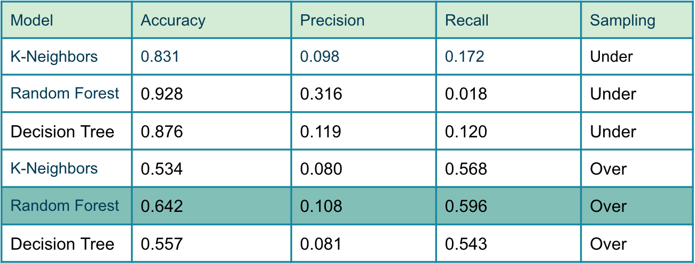

#### Model 2
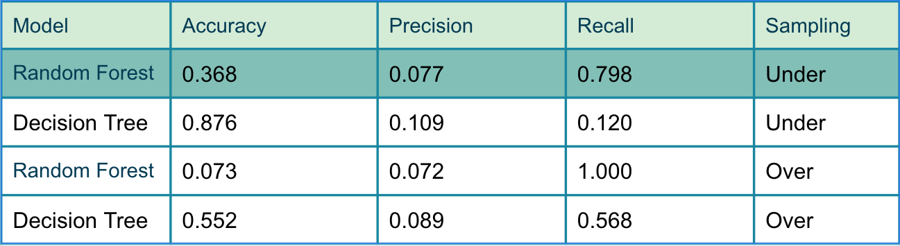

### Tuning and Removing Features
After Choosing my models I tuned them with GridSearchCV to try and get a more balanced and higher percision rate. I choose to remove the following feature for both models as listed: Public Records on file, Home: Mortage, Delinquencies Last 2 yrs, Home: Own, Home: Rent, Home: Any, Loan Length, Home: None. I also removed Employment Length for the first model. Below is the feature importance for each model. 

#### Model 1
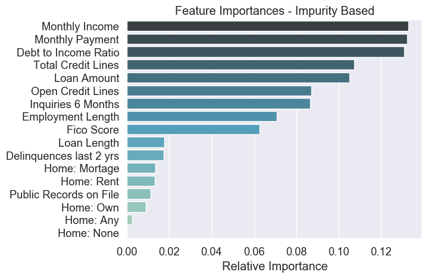

#### Model 2
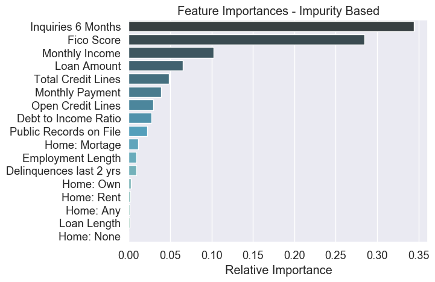

## Results
### Calculating Profit
I wanted to try and calculate the profit taking into account the price of the loan as each loan will incure a diffrent profit. to do this I sperated the data into nine equal sets bassed off of loan amount, calculated the average gain and loss of each range to create the benifit matrix. I then ran my data sets through the models and calcukated profit. The problem with this approach and calculation is that it only trains and tests the model on that single seperated dataset. Below I show my results but the only calculation to take into account is the ALL row that shows the profit from the entire dataset. 

#### Model 1
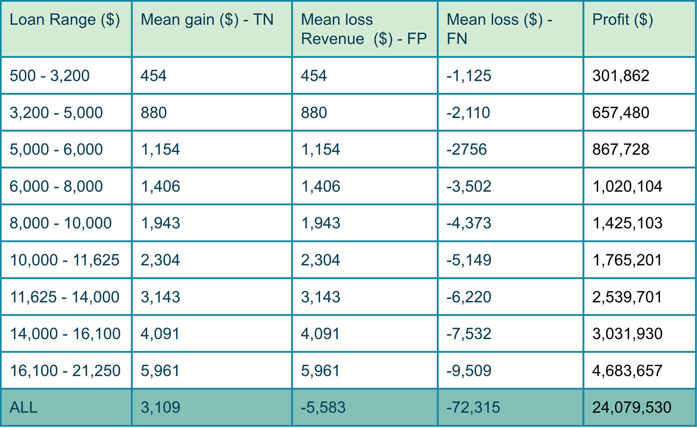
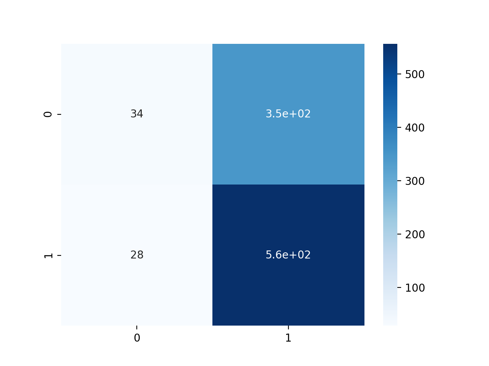

#### Model 2
Here I used a 0.70 thresold to try and balance my accuracy, percision and recall score. My precision score was incredibly low due to the data being so unbalanced. 
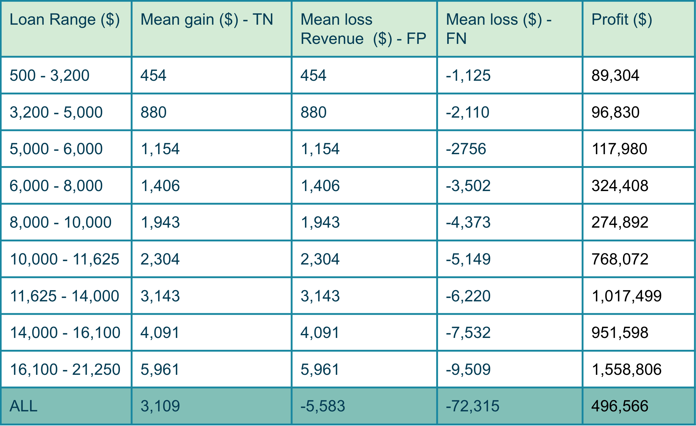
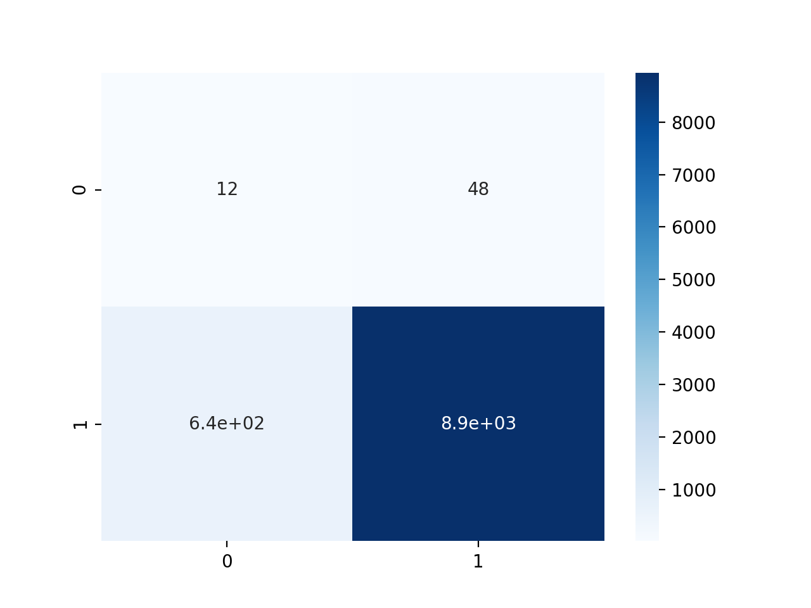

 
